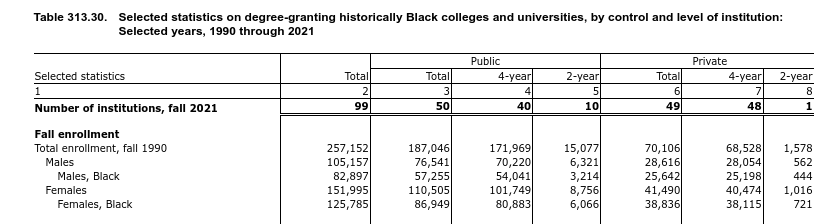

# notes on edge cases

## nsf313_30

[nsf313_30](https://github.com/Spelman-College/spelman-dashboard/tree/main/frontend/src/data/nsf313_30) @ [source](https://nces.ed.gov/programs/digest/d22/tables/dt22_313.30.asp) has 4 categories; `gender`, `race/ethnicity`, `2/4 year college`, and `public/private college`, described by [this category file](https://github.com/Spelman-College/spelman-dashboard/blob/main/frontend/src/data/nsf313_30/categories.ts).

The `race/ethnicity` filter has 1 dimension. By default, within the UI, we'll create a category filter with 1 item, the only dimension. By default, we must select at least 1 dimension in the category filters.

Let's look at a portion of the dataset and see how `race/ethnicity` is used in the data table:

Above, looking at the leftmost column, reading top-down, we can see the first 3 entries:

_(I'll include the DCID for each entry)_

1. a total `Count_Person_EnrolledInCollegeOrGraduateSchool_HBCU`
2. a total for Males `Count_Person_EnrolledInCollegeOrGraduateSchool_Male_HBCU`
3. a total for Black Males `Count_Person_EnrolledInCollegeOrGraduateSchool_Male_HBCU_Black`

For items 2 and 3, notice: we don't have a DCID(and won't be able to show the count) for the cohort that is "not Black"; we only have the total for Black Males and All Males.

### Suggestions

#### Add new query/reduce logic to subtract and get a new metric.

We can create a psuedo dimension in the `race/ethnicity` category, called "Not Black". To get the value for this dimension the query logic would have to be able to subtract the value of the Black Males from the All Males DCID.

This would allow the default behavior of the existing FilterChip component, where when both dimensions are selected, we get total, and when either dimension is selected we get the correct count.

#### Fix in the UI to only show each cohort and the total

We can show a toggle for querying either:

- All Race/Ethnicities
- Only Black

This would require a toggle UI element, like a pair of radio buttons for the `race/ethnicity` category.
